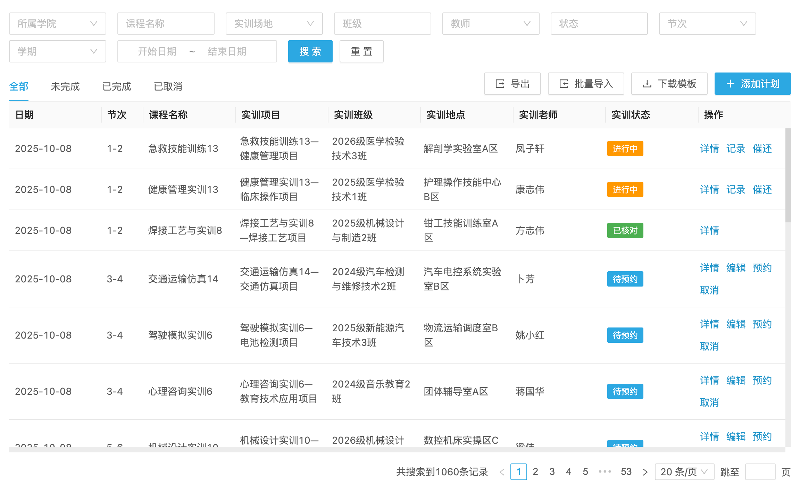
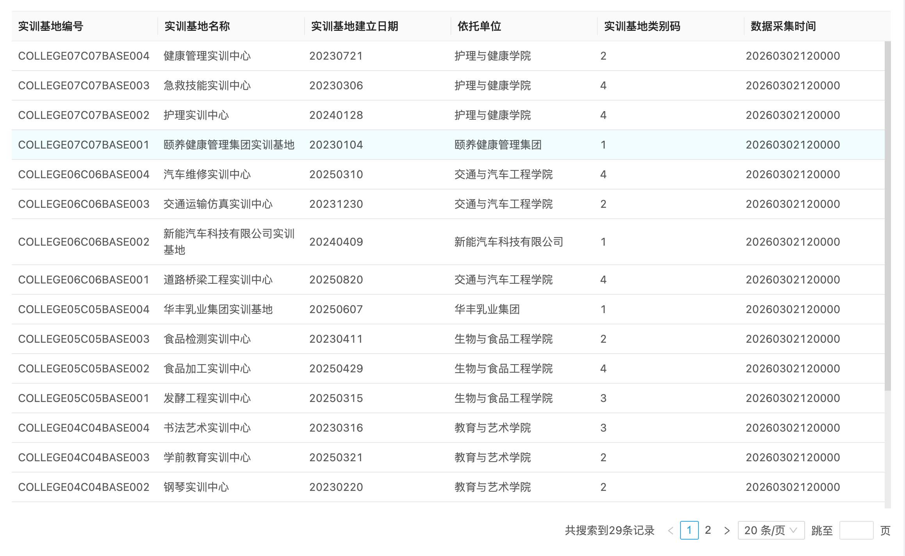

# 职慧实验实训管理平台

职慧实验实训管理平台是[成都七英里科技有限公司](https://qyltec.com)面向职业教育实验实训的数字化产品，聚焦实验室信息化、实践教学治理与数据协同能力建设。平台以“标准化、数字化、自动统计、数据治理”为主线，形成覆盖教学运行、资源治理与数据协同的整体能力体系。

## 1. 产品介绍

职慧实验实训管理平台服务职业院校实训系统与高校实验室管理系统场景，围绕“教学运行、资源治理、数据贯通、管理决策”形成统一的平台能力框架。平台强调可持续建设，支持院校在不同发展阶段逐步完善实训治理能力。

## 2. 行业痛点

实验实训管理平台建设普遍面临以下共性挑战：

- 标准口径分散，跨部门协同成本高。
- 业务链条长，过程数据难以连续沉淀。
- 统计分析滞后，管理决策缺少实时支撑。
- 监管与上报任务重，教育部实验室统计压力持续增加。

## 3. 平台整体解决方案

平台采用“统一标准底座 + 过程数字化 + 自动统计分析 + 治理闭环”方案：

- 统一标准底座：统一数据口径与治理规则。
- 过程数字化：推动关键业务在线协同与留痕管理。
- 自动统计分析：围绕核心指标形成自动统计与趋势洞察。
- 治理闭环：通过分级权限与审计机制提升治理质量。

能力专题入口：

- [架构能力总览](./架构说明/README.md)
- [贵重仪器管理能力](./方案说明/贵重仪器管理说明.md)
- [实训开出率统计能力](./方案说明/实训开出率统计逻辑.md)
- [数字基座标准接口支持能力](./方案说明/数字基座高职数据标准及接口规范支持说明.md)
- [数据治理与分级权限能力](./方案说明/数据治理与分级权限设计.md)

## 4. 核心能力方向

平台能力重点覆盖：

- 教学与实训运行协同
- 资源与场地治理协同
- 安全与合规治理协同
- 统计分析与管理决策协同
- 标准对接与数据交换协同

## 5. 职业院校数字基座高职数据标准及接口规范支持能力

平台支持《职业院校数字基座高职数据标准及接口规范（试行）V3.x》相关建设要求，具备标准映射、质量校验、数据汇聚与规范输出能力，支撑院校形成稳定的数据协同与接口对接基础。

## 6. 教育部高校实验室信息统计系统上报要求支持能力

在数字基座主线下，平台支持教育部高校实验室信息统计系统上报要求相关场景，支持院校在历史口径延续与新标准衔接之间平稳过渡，提升统计一致性与协同效率。

## 7. 实训开出率自动统计

围绕实训开出率建立统一统计框架，支持按组织与学期维度进行自动统计、趋势观察与结构分析，为教学组织优化与资源配置提供依据。

## 8. 贵重仪器管理能力

平台面向贵重仪器管理场景提供一体化治理能力，关注资源效能、过程留痕与管理透明度，支撑高价值实验资源的规范化与共享化管理。

## 9. 数据分级治理能力

平台通过分级授权、流程管控与审计追踪构建数据治理体系，兼顾效率与合规，保障多组织场景下的数据安全、业务协同与管理可追溯性。

## 10. 平台架构设计理念

平台架构坚持“可配置、可扩展、可治理、可持续”原则，兼顾院校当前建设需求与后续迭代空间，支持实验室信息化长期发展。

## 11. 在线体验入口

- 在线体验（演示环境）：[https://vtms-dev.qyltec.com](https://vtms-dev.qyltec.com)

## 12. 平台界面预览

### 登录

### 实训计划

### 实训基地数据上报

## 13. 商务合作联系方式

- 公司主体：成都七英里科技有限公司
- [公司官网](https://qyltec.com)
- 联系人：罗经理
- 联系邮箱：rd@qyltec.com
- 合作区域：全国职业院校与高校实验教学场景
- 合作类型：平台建设、数据治理、标准对接、运维服务
- 微信二维码：

